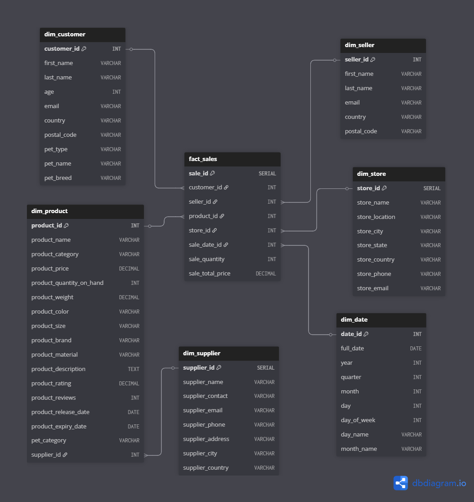

# Big_Data_Analysis_lab1
# Лабораторная работа №1: Нормализация данных в модель «Снежинка»

### Описание проекта

В рамках лабораторной работы выполнена трансформация исходных данных из 10 CSV-файлов (MOCK_DATA_1.csv … MOCK_DATA_10.csv) в аналитическую модель «снежинка» (Snowflake Schema) в СУБД PostgreSQL.  
Исходные данные содержат информацию о продажах товаров для домашних питомцев: покупатели, продавцы, товары, поставщики, магазины, даты продаж.

Цель: перейти от плоской таблицы к нормализованной структуре с таблицами фактов и измерений для удобства аналитических запросов.

### Инструкция

1. Клонирование репозитория
```
git clone https://github.com/mnlyuzina/Big_Data_Analysis_lab1
```
2. Запуск контейнера
```bash
docker-compose up -d
```
3. Подключение к базе данных
```bash
docker exec -it postgres_lab psql -U labuser -d labdb
```
4. Остановка и удаление контейнера
```bash
docker-compose down -v
```

### Анализ исходных данных
Сырые данные загружены в таблицу `raw_sales_data`.
#### Общее количество записей
```
SELECT COUNT(*) FROM raw_sales_data;
```
**Результат:** 10000 - все строки загружены
#### Выявление уникальных сущностей

#### Покупатели
| sale_customer_id | customer_first_name | customer_last_name | customer_age | customer_email                    | customer_country           | customer_postal_code | customer_pet_type | customer_pet_name | customer_pet_breed      |
|-----------------:|---------------------|--------------------|-------------:|-----------------------------------|----------------------------|----------------------|-------------------|-------------------|--------------------------|
| 1 | Consolata | Dufoure | 21 | awigginton0@wordpress.com | China | | dog | Kirsti | Parakeet |
| 1 | Barron | Rawlyns | 61 | bmassingham0@army.mil | China | | cat | Priscella | Labrador Retriever |
| 1 | Mab | Cobb | 25 | lhamor0@smugmug.com | Brazil | 93180-000 | dog | Maura | Parakeet |
| 1 | Heida | Tertre | 64 | dkinchington0@cnet.com | Nigeria | | dog | Mari | Siamese |
| 1 | Consolata | Campsall | 68 | kmckean0@merriam-webster.com | Indonesia | | bird | Ninnetta | Parakeet |
| 1 | Quintina | Tomaszynski | 71 | lmaffin0@godaddy.com | Bosnia and Herzegovina | | dog | Fee | Labrador Retriever |
| 1 | Rourke | Rackley | 55 | pelkington0@vk.com | Russia | 249432 | dog | Kellsie | Siamese |
| 1 | Stern | Ong | 29 | aniven0@twitter.com | Philippines | 5016 | cat | Berri | Labrador Retriever |
| 1 | Conni | Leydon | 63 | lswait0@amazon.com | France | 77404 CEDEX | cat | Jan | Labrador Retriever |
| 1 | Nanny | Okenfold | 69 | scapron0@blogtalkradio.com | Argentina | 3351 | cat | Ardene | Parakeet |

```
SELECT COUNT(DISTINCT sale_customer_id) AS unique_customers FROM raw_sales_data;
```
**Результат:** 1000 уникальных customer_id

#### Продавцы
| sale_seller_id | seller_first_name | seller_last_name | seller_email                    | seller_country                     | seller_postal_code |
|---------------:|-------------------|------------------|---------------------------------|------------------------------------|--------------------|
| 453 | Fianna | Cordero | fcorderock@lycos.com | Burkina Faso | |
| 219 | Raul | Manthorpe | rmanthorpe62@admin.ch | Russia | 352177 |
| 271 | Aeriell | Anstice | aanstice7i@newsvine.com | Russia | 102471 |
| 216 | Quintus | Tupling | qtupling5z@gmpg.org | Japan | 818-0138 |
| 172 | Barri | Samweyes | bsamweyes4r@imgur.com | China | |
| 692 | Layne | Brompton | lbromptonj7@amazon.co.jp | Russia | 215807 |
| 463 | Ranique | Burnand | rburnandcu@addthis.com | Peru | |
| 226 | Ericka | Tomasek | etomasek69@example.com | France | 25024 CEDEX |
| 521 | Alfonse | Deevey | adeeveyeg@furl.net | Philippines | 3316 |
| 12 | Birch | Tollet | btolletb@ehow.com | Colombia | 685518 |


```
SELECT COUNT(DISTINCT sale_seller_id) AS unique_sellers FROM raw_sales_data;
```
**Результат:** 1000 уникальных seller_id

#### Товары
| sale_product_id | product_name | product_category | product_price |
|----------------:|--------------|------------------|--------------:|
| 428 | Bird Cage | Toy | 43.50 |
| 187 | Bird Cage | Toy | 22.46 |
| 746 | Cat Toy | Cage | 29.48 |
| 650 | Cat Toy | Toy | 52.58 |
| 642 | Cat Toy | Cage | 86.60 |
| 50 | Dog Food | Cage | 89.05 |
| 38 | Cat Toy | Food | 14.87 |
| 505 | Dog Food | Toy | 78.15 |
| 473 | Cat Toy | Cage | 82.05 |


```
SELECT COUNT(DISTINCT sale_product_id) AS unique_products FROM raw_sales_data;
```
**Результат:** 1000 уникальных product_id

#### Поставщики
| supplier_name | supplier_contact | supplier_email | supplier_phone | supplier_address | supplier_city | supplier_country |
|---------------|------------------|----------------|----------------|------------------|---------------|------------------|
| Devpulse | Chen McKnish | cmcknish6q@cnbc.com | 580-572-6321 | 12th Floor | Albergaria | Slovenia |
| Oodoo | Dell Ferguson | dferguson5n@blogger.com | 923-627-9803 | PO Box 2034 | Barra de São Francisco | Brazil |
| Bluejam | Giorgio Sparke | gsparkejo@wired.com | 329-552-1965 | Room 435 | Dajalorong | Canada |
| Pixonyx | Jennica Bonn | jbonno3@ebay.com | 544-823-6160 | Apt 1780 | Masiga | Poland |
| Twimm | Abrahan Kemp | akempkx@parallels.com | 699-917-8742 | 19th Floor | Saint John’s | China |

```
SELECT COUNT(DISTINCT (supplier_name, supplier_contact, supplier_email)) AS unique_suppliers FROM raw_sales_data;
```
**Результат:** 10000 уникальных поставщиков

#### Магазины

| store_name | store_location | store_city | store_state | store_country | store_phone | store_email |
|------------|----------------|------------|-------------|---------------|-------------|-------------|
| Oyoyo | 6th Floor | Panamá | | Czech Republic | 283-165-2726 | cverrechia2x@discovery.com |
| Dabfeed | Room 988 | Longjing | | Cameroon | 929-579-5098 | astigerjh@nyu.edu |
| Miboo | 14th Floor | Tsagaan-Olom | | Nepal | 486-424-9332 | wbardwellh1@ovh.net |
| Jayo | Apt 55 | Guanjiabao | | Russia | 352-706-3847 | tlisciandri5y@storify.com |
| Thoughtstorm | PO Box 45988 | Xinshichang | | China | 763-748-3335 | mcelezl9@businessweek.com |


```
SELECT COUNT(DISTINCT (store_name, store_location, store_city, store_state, store_country)) AS unique_stores FROM raw_sales_data;
```
**Результат:** 10000 уникальных магазинов

#### Даты
Показаны первые и последние 5 строк данных

| sale_date |
|-----------|
 2021-01-01
 2021-01-02 
 2021-01-03 
 2021-01-04 
 2021-01-05 
 2021-12-26 
 2021-12-27 
 2021-12-28 
 2021-12-29 
 2021-12-30
```
SELECT COUNT(DISTINCT sale_date) FROM raw_sales_data;
```
**Результат:** 364 уникальных дат

В сырых данных идентификаторы покупателей, продавцов и товаров повторялись в разных файлах, поэтому для таблиц dim_customer, dim_seller, dim_product использован DISTINCT ON с выбором первого вхождения – получены уникальные ключи. В таблице поставщиков повторялись названия, но комбинация с контактом и email была уникальной, поэтому DISTINCT применён по трём полям. В данных магазинов встречались NULL в поле store_state, что при JOIN приводило к потере строк; исправлено заменой NULL на 'Unknown' через COALESCE как при вставке в dim_store, так и при соединении с fact_sales. Таблица дат не требовала корректировки – все даты уникальны. После этих мер все измерения стали нормализованными, а факты ссылаются на них через внешние ключи, обеспечивая целостность модели.

### Идентификация фактов
Каждая строка содержит числовые показатели продажи: sale_quantity, sale_total_price, а также ссылки на идентификаторы sale_customer_id, sale_seller_id, sale_product_id, sale_date. Эти поля образуют таблицу фактов.

На основе анализа, были спроектированы следующие таблицы, которые представлены на ER-диаграмме:


### Скрипты DDL и DML
Все операции по созданию таблиц и заполнению данных находятся в файле init.sql.
Он выполняет следующие шаги:
1. Удаляет старые таблицы (если существуют).
2. Создаёт таблицу raw_sales_data с полями, соответствующими CSV.
3. Загружает 10 CSV-файлов из папки /attachments/ (внутри контейнера).
4. Создаёт измерения, используя DISTINCT и замену NULL на 'Unknown' для полей магазина.
5. Создаёт таблицу фактов fact_sales, связывая данные через JOIN с измерениями.
6. Добавляет индексы для производительности.

### Проверка результатов
Для проверки корректности нормализации использовались следующие запросы:
```
SELECT SUM(f.sale_total_price) AS fact_sum, 
       (SELECT SUM(sale_total_price) FROM raw_sales_data) AS raw_sum
FROM fact_sales f;
```
**Результат:** Сумма продаж в фактах совпадает с суммой в сырых данных
| fact_sum | raw_sum |
| -------- | ------- |
|2529852.12|2529852.12|

```
SELECT COUNT(DISTINCT customer_id) FROM fact_sales;
```
**Результат:** 1000 уникальных покупатель в фактах.
| count |
|-------|
|1000|


```
SELECT 'customer' AS dim, COUNT(*) FROM fact_sales f LEFT JOIN dim_customer c ON f.customer_id = c.customer_id WHERE c.customer_id IS NULL
UNION ALL
SELECT 'seller', COUNT(*) FROM fact_sales f LEFT JOIN dim_seller s ON f.seller_id = s.seller_id WHERE s.seller_id IS NULL
UNION ALL
SELECT 'product', COUNT(*) FROM fact_sales f LEFT JOIN dim_product p ON f.product_id = p.product_id WHERE p.product_id IS NULL
UNION ALL
SELECT 'store', COUNT(*) FROM fact_sales f LEFT JOIN dim_store st ON f.store_id = st.store_id WHERE st.store_id IS NULL
UNION ALL
SELECT 'date', COUNT(*) FROM fact_sales f LEFT JOIN dim_date d ON f.sale_date_id = d.date_id WHERE d.date_id IS NULL;
```
**Результат:** Отсутствие "висячих" внешних ключей
|dim| count |
|-------|---|
|customer|0|
|seller|0|
|product|0|
|store|0|
|date|0|

```
SELECT MIN(d.full_date) AS min_date, MAX(d.full_date) AS max_date
FROM fact_sales f JOIN dim_date d ON f.sale_date_id = d.date_id;
```
**Результат:** Ожидаемый диапазон продаж
|min_date|max_date|
|-------|---|
|2021-01-01|2021-12-30|

```
SELECT d.year, d.month, d.month_name, SUM(f.sale_total_price) AS total_sales
FROM fact_sales f
JOIN dim_date d ON f.sale_date_id = d.date_id
GROUP BY d.year, d.month, d.month_name
ORDER BY d.year, d.month
LIMIT 12;
```
**Результат:** Выручка по месяцам - положительные суммы
|year | month | month_name | total_sales| 
|-----|-------|------------|------------|
|2021 |     1 | January    |   224158.54|
|2021 |     2 | February   |   192348.31|
|2021 |     3 | March      |   207282.20|
|2021 |     4 | April      |   206592.82|
|2021 |     5 | May        |   211764.86|
|2021 |     6 | June       |   215042.80|
|2021 |     7 | July       |   220496.51|
|2021 |     8 | August     |   221275.78|
|2021 |     9 | September  |   210623.43|
|2021 |    10 | October    |   228743.32|
|2021 |    11 | November   |   200154.69|
|2021 |    12 | December   |   191368.86|

```
SELECT COUNT(*) FROM fact_sales WHERE sale_quantity <= 0 OR sale_total_price <= 0;
```
**Результат:** Отсутствие недопустимых количеств или сумм
|count|
|-----|
|0|
